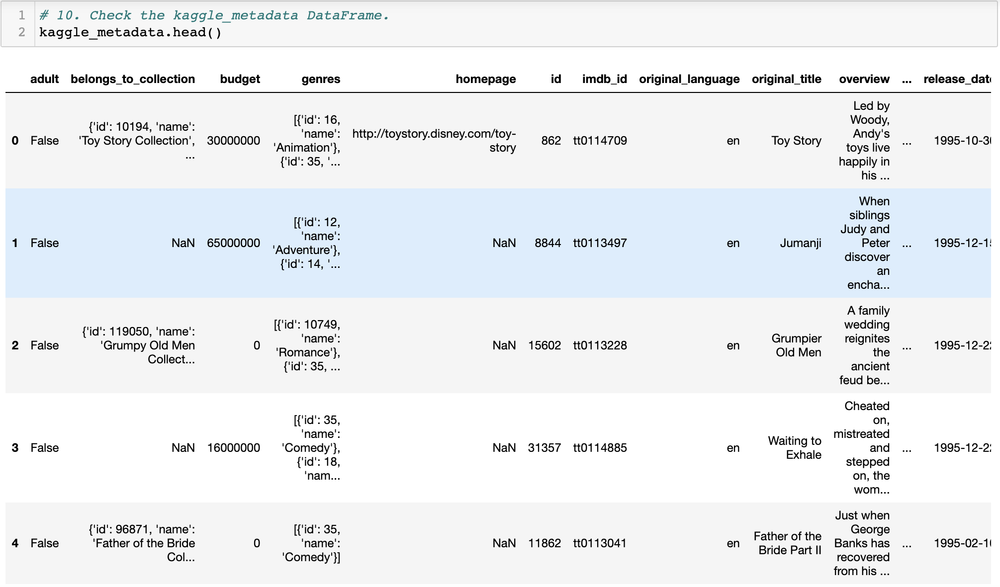
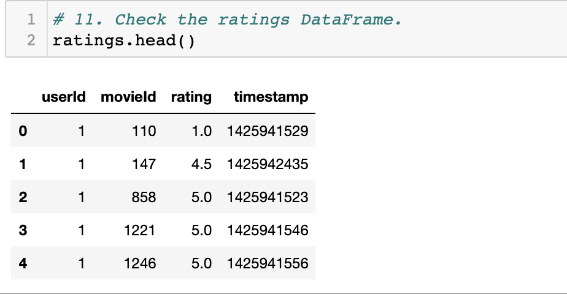
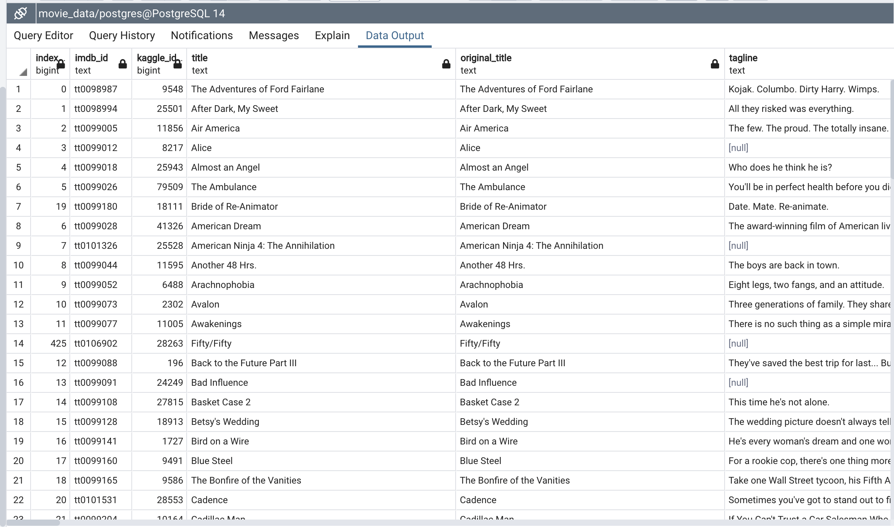
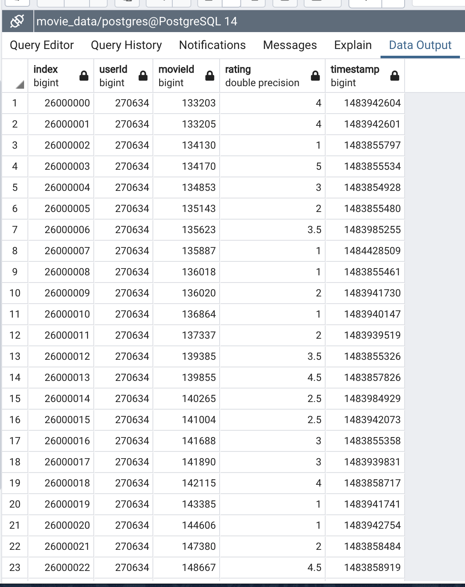

# Movie_Data_ETL
Extract, Transform, and Load

Extract - Read the data, often from multiple sources
Transform - Clean and structure the data in desired form
Load - Write the data into a datbase for storage
# Background
> Amazing Prime needs help to create an automated pipeline that takes in new data, performs the appropriate transformations, and loads the data into existing tables. To create one function that takes in the three files—Wikipedia data, Kaggle metadata, and the MovieLens rating data—and performs the ETL process by adding the data to a PostgreSQL database.

## Overview
> Deliverable 1: Write an ETL Function to Read Three Data Files
> Deliverable 2: Extract and Transform the Wikipedia Data
> Deliverable 3: Extract and Transform the Kaggle data
> Deliverable 4: Create the Movie Database

### Resources:
* Data Source: wikipedia-movies.json, movies_metadata.csv, ratings.csv
* Software: Python 3.7.7, Anaconda Navigator 1.9.12, Conda 4.8.4, Jupyter Notebook 6.0.3, PostgreSQL 11.9, pgAdmin 4

## Deliverable 1:
1. Create a function to read in the three files and give it a name.
2. read in the Kaggle metadata and MovieLens ratings CSV files as Pandas DataFrames.
3. open the Wikipedia JSON file and use the json.load() function to convert the JSON data to raw data.
4. read in the raw Wikipedia movie data as a Pandas DataFrame.
5. use the code provided to return the three DataFrames.
6. use the variables provided to create a path to the Wikipedia data, the Kaggle metadata, and the MovieLens rating data files.
7. set the three variables in Step 6 equal to the function created in Step 1
8. set the DataFrames from the return statement equal to the file names in Step 6. In this step, you are reassigning the variables created in Step 6 to the variables in the return statement.
9. In Steps 9-11, check that all three files are converted to a DataFrame. See the images below for confirmation:
10. The wiki_movies_df DataFrame:
.png)
11. The kaggle_metadata DataFrame

12. The ratings DataFrame

## Deliverable 2:
1. In Step 1, add the code from this module for the clean movie function that takes in the argument "movie".
2. In Step 2, add the function you created in Deliverable 1 that reads in the three data files.
3. In Step 3, inside the function you created in Deliverable 1, remove the code that creates the wiki_movies_df DataFrame from the wiki_movies_raw file, then write a list comprehension that filters out TV shows from the wiki_movies_raw file.
4. In Step 4, write a list comprehension to iterate through the cleaned wiki movies list that you created in Step 3.
5. In Step 5, read in the cleaned movies list from Step 4 as a DataFrame.
6. In Step 6, write a try-except block that will catch errors while extracting the IMDb IDs with a regular expression string and dropping any imdb_id duplicates. If there is an error, capture and print the exception.
7. In Step 7, write a list comprehension to keep the columns that have non-null values from the DataFrame created in Step 5, then create a wiki_movies_df DataFrame from the list.
8. In Step 8, create a variable that will hold all the non-null values from the "Box office" column.
9. In Step 9, convert the box office data created in Step 8 to string values using the lambda and join functions.
10. In Step 10, write a regular expression to match the six elements of form_one of the box office data.
11. In Step 11, write a regular expression to match the three elements of form_two of the box office data.
12. In Step 12, add the parse_dollars() function.
13. In Step 13, add the code that cleans the box office column in the wiki_movies_df DataFrame using the form_one and form_two lists created in Steps 10 and 11, respectively.
14. In Step 14, add code that cleans the budget column in the wiki_movies_df DataFrame.
15. In Step 15, add code that cleans the release date column in the wiki_movies_df DataFrame.
16. In Step 16, add code that cleans the running time column in the wiki_movies_df DataFrame.
17. In Step 17, use the variables provided to create a path to the Wikipedia data, the Kaggle metadata, and the MovieLens rating data files.
18. In Step 18, set the three variables in Step 17 equal to the function created in Deliverable 1.
19. In Step 19, set the wiki_movies_df equal to the wiki_file variable.
20. In Step 20, check that your wiki_movies_df DataFrame looks like this image:
.png)
21. In Step 21, add the columns from wiki_movies_df DataFrame to a list, and confirm that they are the same as this image:
.png)
## Deliverable 3:
1. In Step 1, add the function you created in Deliverable 1 that reads in the three data files and creates the kaggle_metadata and ratings DataFrames.
2. Before Step 2, add all the code you wrote for Deliverable 2.
3. In Step 2, below the code that cleans the running time column in the wiki_movies_df DataFrame from Deliverable 2, add the code that cleans the Kaggle metadata.
4. In Step 3, merge the wiki_movies_df DataFrame and the kaggle_metadata DataFrames, then name the new DataFrame, movies_df.
5. In Step 4, drop unnecessary columns from the movies_df DataFrame.
6. In Step 5, add the fill_missing_kaggle_data() function that fills in the missing Kaggle data on the movies_df DataFrame.
7. In Step 6, call the fill_missing_kaggle_data() function with the movies_df DataFrame and the Kaggle and Wikipedia columns to be cleaned as the arguments.
8. In Step 7, filter the movies_df DataFrame to keep the necessary columns.
9. In Step 8, rename the columns in the movies_df DataFrame.
10. In Step 9, transform and merge the ratings DataFrame with the movies_df DataFrame, name the new DataFrame movies_with_ratings_df, then clean the movies_with_ratings_df DataFrame.
11. In Step 10, use the variables provided to create a path to the Wikipedia data, the Kaggle metadata, and the MovieLens rating data files.
12. In Step 11, set the three variables from Step 17 of Deliverable 2 equal to the function created in Deliverable 1.
13. In Step 12, set the DataFrames from the return statement after Step 9 equal to the file names in Step 11.
14. In Step 13, check that your wiki_movies_df DataFrame is the same as in Deliverable 2.
15. In Step 14, check that your movies_with_ratings_df DataFrame looks like this image:
.png)

16. In Step 15, check that your movies_df DataFrame looks like this image:
.png)

## Deliverable 4:
1. In the first cell, uncomment the # from config import db_password so this code is working.
2. Remove the return statement, return wiki_movies_df, movies_with_ratings_df, movies_df.
3. After Step 9, Transform and merge the ratings DataFrame, add the code to create the connection to the PostgreSQL database, then add the movies_df DataFrame to a SQL database.
Hint: Use 'replace' for the if_exists parameter so that the movies_df DataFrame data won't be added to the table again.

4. Before reading in the MovieLens rating CSV data, drop the ratings table in pgAdmin.
5. Add the code that prints out the elapsed time to import each row.
6. Refactor Step 11 of Deliverable 3 so that you pass in the variables for the files created in Step 10 of Deliverable 3 in the function created in Deliverable 1.
7. Run the program.
8. After the program has finished, run a query on the PostgreSQL database that retreives the number of rows for the movies and ratings tables.
9. After you confirm that the movies table has 6,052 rows and the ratings table has 26,024,289 rows, take a screenshot of each query and the output, then save them as movies_query.png and ratings_query.png, respectively.

Movie query and output:

Ratings query and output:

## Summary
The Extract, transform and load function created collects and cleans movie data from different sources like: Wikipedia JSON ,Kaggle(movies_metadata.csv) and ratings csv files . It transforms and merges the data and loads it into two updatable PostgreSQL dataset tables ready to be used by the hackathon participants for their analysis.